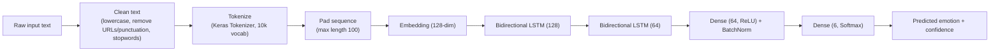

<div align="center">

# 🧠 EmotiSense — Emotion Classification from Text

**A deep learning web app that detects the emotion behind any sentence — in real time.**

[](https://www.python.org/)
[](https://www.tensorflow.org/)
[](https://streamlit.io/)
[](LICENSE)

[**🚀 Live Demo**](#-live-demo) · [Features](#-features) · [How it works](#-how-it-works) · [Run locally](#-run-locally) · [Project structure](#-project-structure)

</div>

---

## 📌 Overview

EmotiSense is an NLP project that classifies a piece of text into one of **six emotions** — anger, fear, joy, love, sadness, or surprise — using a **Bidirectional LSTM** neural network trained from scratch with TensorFlow/Keras. The model is wrapped in a polished, interactive **Streamlit** interface with live confidence scores, a per-class probability chart, and prediction history.

> Type a sentence → the model reads it both forward and backward through two stacked BiLSTM layers → it returns the most likely emotion with a full confidence breakdown.

## Live demo:
https://huggingface.co/spaces/nourannasser22/emotion-detector-nlp

## ✨ Features

- Real-time emotion prediction from free-text input, with six emotion classes covered
- Confidence score and a full per-emotion probability breakdown rendered as an interactive bar chart
- Built-in example sentences for a one-click demo, plus a running session history of recent predictions
- Clean, custom-themed UI (no default Streamlit look) built entirely with Streamlit + Plotly

## 🧩 How it works



### Model architecture

| Layer                  | Configuration                          |
|-------------------------|-----------------------------------------|
| Embedding                | `input_dim=10000, output_dim=128`        |
| Bidirectional LSTM (1)   | 128 units, returns full sequence + Dropout(0.3) |
| Bidirectional LSTM (2)   | 64 units + Dropout(0.3)                  |
| Dense                     | 64 units, ReLU + BatchNormalization + Dropout(0.3) |
| Output                    | Dense(6), Softmax                        |

Trained with the Adam optimizer (`lr=1e-3`), sparse categorical cross-entropy loss, and `EarlyStopping` / `ReduceLROnPlateau` callbacks to avoid overfitting.

### Dataset

A labeled English-language sentence dataset with six emotion classes (`anger`, `fear`, `joy`, `love`, `sadness`, `surprise`), split into 16,000 training, 2,000 validation, and 2,000 test sentences.

### Test set performance

| Emotion   | Precision | Recall | F1-score | Support |
|-----------|-----------|--------|----------|---------|
| Anger     | 0.93      | 0.90   | 0.92     | 275     |
| Fear      | 0.82      | 0.91   | 0.86     | 224     |
| Joy       | 0.94      | 0.93   | 0.94     | 695     |
| Love      | 0.77      | 0.84   | 0.80     | 159     |
| Sadness   | 0.98      | 0.94   | 0.96     | 581     |
| Surprise  | 0.72      | 0.74   | 0.73     | 66      |
| **Overall accuracy** | | | **0.91** | 2000 |

## 🛠 Tech stack

| Layer            | Tools |
|-------------------|-------|
| Modeling           | TensorFlow / Keras, scikit-learn |
| NLP preprocessing  | NLTK (stopwords), Keras Tokenizer |
| App / UI           | Streamlit, Plotly |
| Model hosting       | Hugging Face Hub |
| Notebook            | Jupyter / Google Colab |

## 📂 Project structure

```
emotion-classification-nlp/
├── app.py                                # Streamlit application
├── requirements.txt                      # Python dependencies
├── artifacts/                            # Small inference artifacts (versioned)
│   ├── tokenizer.pkl                     # Fitted Keras tokenizer
│   ├── label_map.pkl                     # index → emotion label mapping
│   └── max_length.npy                    # padding length used at training time
├── notebooks/
│   └── emotion_classification_training.ipynb   # full training pipeline (EDA → training → evaluation)
├── LICENSE
└── README.md
```

> **Note on the model file:** `best_model.keras` (~20 MB) is intentionally **not** committed to this repository — trained model binaries are build artifacts, not source code, and don't belong in git history. It's attached to a [GitHub Release](../../releases) on this same repo instead, and downloaded automatically the first time the app runs (see [Deployment](#-deployment)).

## 💻 Run locally

```bash
# 1. Clone the repo
git clone https://github.com/nourannasser2210/emotion-classification-nlp.git
cd emotion-classification-nlp

# 2. Create a virtual environment (recommended)
python -m venv venv
source venv/bin/activate   # On Windows: venv\Scripts\activate

# 3. Install dependencies
pip install -r requirements.txt

# 4. Run the app
streamlit run app.py
```

On first run, the app downloads the trained model from this repo's GitHub Release automatically — no manual setup needed. For local development you can alternatively drop `best_model.keras` straight into `artifacts/` (it's git-ignored) and the app will use it instead.

## ☁️ Deployment

This app is designed to deploy on **Streamlit Community Cloud** for free, with the model itself attached to a **GitHub Release** on this repo so nothing large ever touches the git history:

1. On this repo's GitHub page, go to **Releases → Create a new release**, give it the tag `v1.0.0`, and attach `best_model.keras` as a release asset.
2. Push the rest of this repository to GitHub (the model file stays excluded via `.gitignore`).
3. On [share.streamlit.io](https://share.streamlit.io), create a new app pointing at this GitHub repo and `app.py`.
4. Done — Streamlit Cloud installs `requirements.txt` and the app downloads the model from the Release asset URL on first launch.

## 🚧 Future improvements

- Swap the BiLSTM for a fine-tuned transformer (e.g. DistilBERT) to push accuracy higher, especially on the underrepresented `surprise` class
- Add multi-language support
- Add a public inference API endpoint alongside the Streamlit UI

## 👩‍💻 Author

**Nouran Nasser**
GitHub: [@nourannasser2210](https://github.com/nourannasser2210)

## 📄 License

This project is licensed under the [MIT License](LICENSE).
## linkedin post :
https://www.linkedin.com/posts/nouran-nasser22_datascience-machinelearning-deeplearning-activity-7478130752778350594-e8o9?utm_source=share&utm_medium=member_desktop&rcm=ACoAAEdWprcBjyUYsBMA4R5EfNePVsxkCEsNl6w
